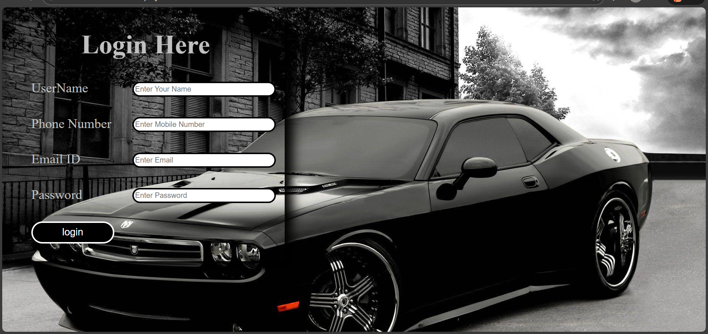

🚗 Login Page – Interactive Form

📌 Project Overview
This project is a responsive and visually appealing Login Page created using HTML and CSS.
It features a modern UI design with a full-screen background image, styled input fields, and a clean login layout suitable for frontend practice and portfolio projects.

🛠️ Technologies Used
HTML5 – Structure of the login form
CSS3 – Styling, layout, and background image
Browser – Google Chrome / Edge (for testing)

✨ Features
User-friendly Login Form
Input fields for:
Username
Phone Number
Email ID
Password
Stylish Login Button
Background image applied using CSS
Responsive and clean UI design

🖼️ Background Image Implementation (CSS)
The background image is added using CSS for a modern look and better control over styling.
Example:
Copy code
Css
body {
    background-image: url("car.jpg");
    background-size: cover;
    background-position: center;
    background-repeat: no-repeat;
    
}

✔ background-size: cover ensures full-screen coverage
✔ background-position: center keeps the image aligned
✔ background-repeat: no-repeat avoids repetition
📁 Project Structure
Copy code

interactive-form/
│
├── README.md
├── index.html
├── style.css
└── output.png

🚀 How to Run the Project
Download or clone the repository
Open index.html in any web browser
Ensure the image path in CSS is correct

🎯 Use Cases
Frontend practice project
Login page UI design
Portfolio website component
HTML & CSS learning project

📸 Project Output

The output displays a stylish login page with a car-themed background image, creating a premium and modern look.

🧑‍💻 Author
Apoorva Duggireddy
Frontend Developer 