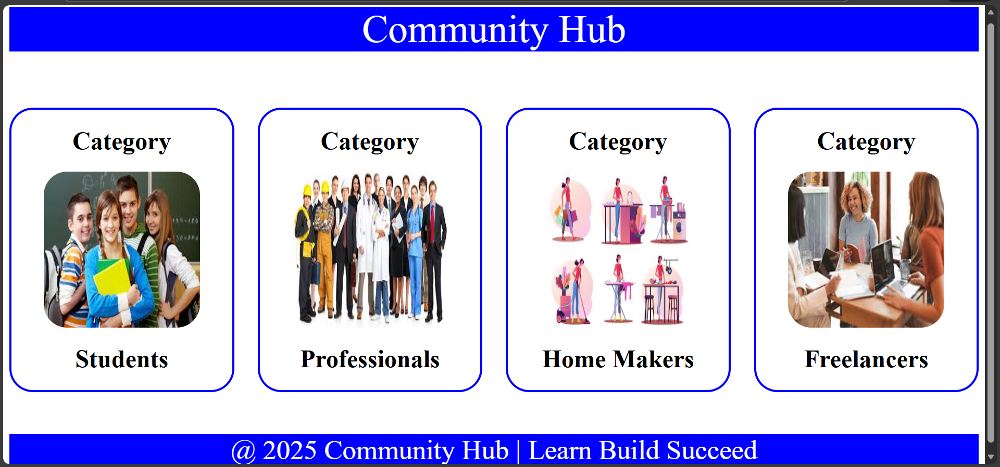
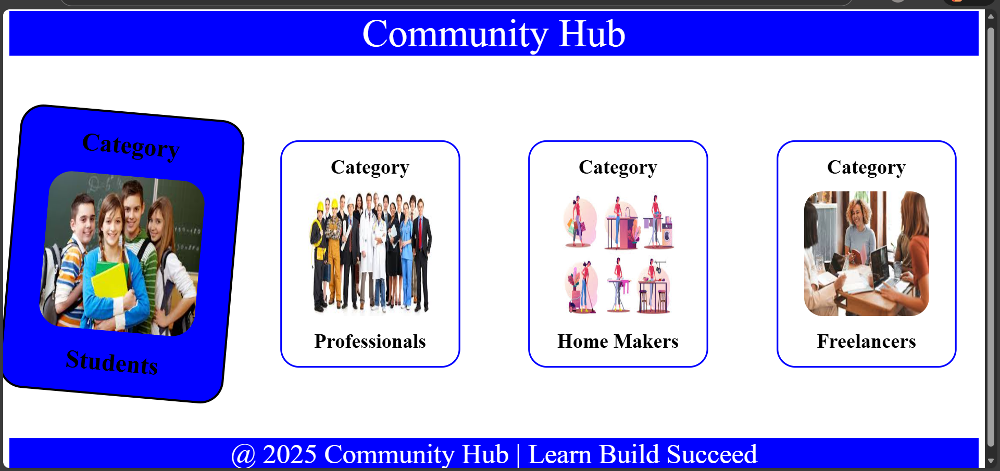

Community Hub UI 🌐

A beginner-friendly frontend practice project built using HTML and CSS, focusing on layout design, image handling, and hover-based interactivity.

---

📌 Project Overview

The Community Hub UI displays different user categories using image cards.
Each card is styled with CSS and includes a hover effect to enhance user interaction.

This project was created as part of hands-on learning to strengthen core frontend development concepts.

---

🛠️ Technologies Used

HTML5 – Page structure and content

CSS3 – Styling, layout, and hover effects

---

✨ Features

Clean and structured UI

Category cards with images

Smooth hover effect on image click/hover

Well-organized project structure

Beginner-friendly implementation

---

📂 Project Structure

/community-hub
│── index.html
│── style.css
│── README.md
│
└── images/
    ├── inputs/
    │    ├── image1.png
    │    ├── image2.png
    │    ├── image3.png
    │    └── image4.png
    │
    └── outputs/
         ├── normalView.png
         └── hoverImg.png

---

📸 Project Preview

🔹 Normal View

🔹 Hover Effect View

---

🎯 Learning Outcomes

Learned proper HTML structure for image-based layouts

Gained hands-on experience with CSS styling and hover effects

Understood how to organize input and output assets professionally

Improved confidence in building interactive UI components

---

🚀 Future Enhancements

Make the design fully responsive

Add JavaScript for dynamic interactions

Improve UI using animations and transitions

---

👩‍💻 Author

Apoorva Duggireddy
Frontend Learner | Web Development Enthusiast